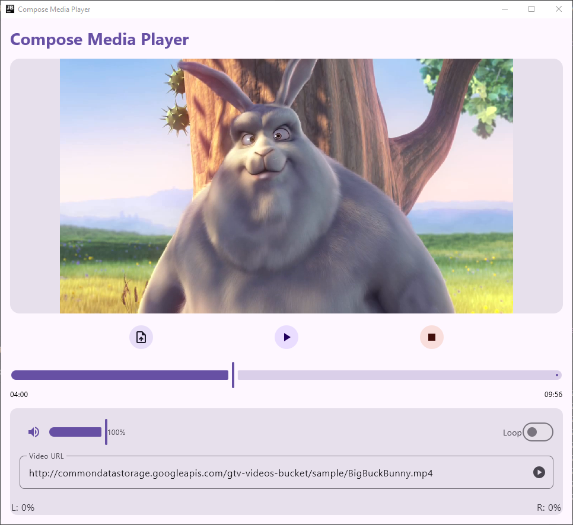
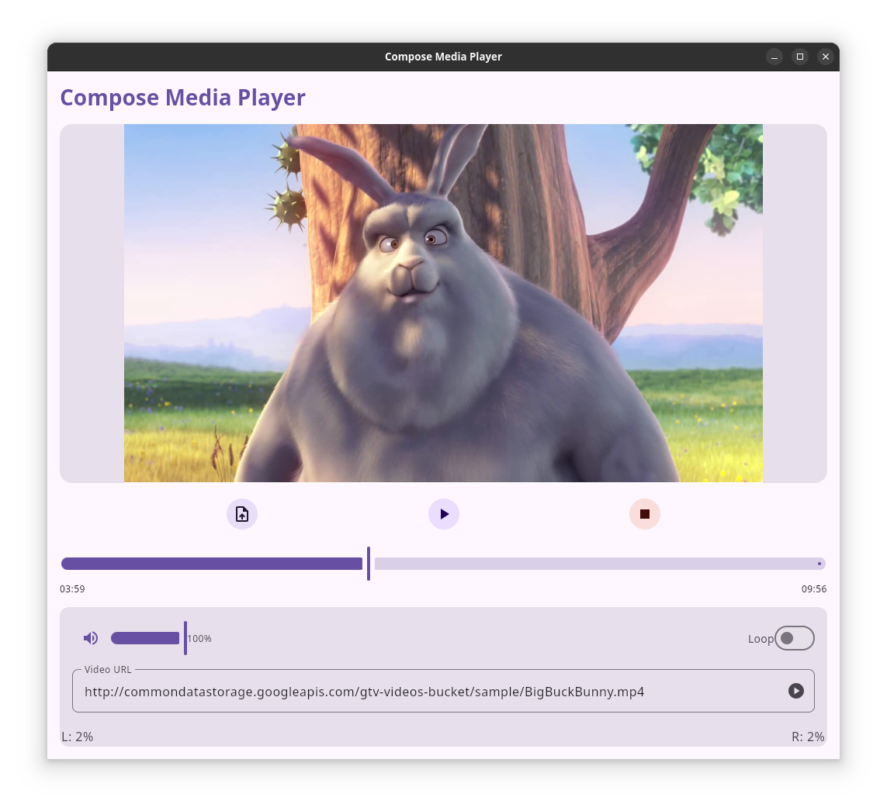

# 🎥 Compose Media Player

**Compose Media Player** is a video player library designed for Compose Multiplatform, supporting multiple platforms including Android, macOS, Windows, and Linux. It is the first fully functional multiplatform video player for Compose for Desktop that requires no additional software installations. The library leverages:

- **GStreamer** for Linux
- **MFPlayer** for Windows
- **JavaFX** for macOS
- **Media3** for Android
- **AVPlayer** for iOS
- **HTML5 Player** for WASMJS

## 🚀 Live Demo

Try the online demo here : [🎥 Live Demo](https://kdroidfilter.github.io/ComposeMediaPlayer/sample/)

## ✨ Features

- **Multiplatform Support**: Works seamlessly on Android, macOS, Windows, Linux and Compose Web (Wasm).
- **File and URL Support**: Play videos from local files or directly from URLs.
- **Media Controls**: Includes play, pause, loop toggle, volume control, loop playback and timeline slider.
- **Custom Video Player UI**: Fully customizable using Compose Multiplatform.
- **Audio Levels**: Displays left and right audio levels in real time.
- **Error handling** Simple error handling for network or playback issues.

## ✨ Supported Formats
| Video Format | Windows | macOS | Linux | Android | iOS | WasmJS |
|--------------|---------|-------|-------|---------|-----|--------|
| MP4 (H.264)  | ✅       | ✅     | ✅     | ✅       | ✅   | ✅      |
| AVI          | ✅       | ❌     | ✅     | ✅       | ❌   | ❌      |
| MKV          | ?       | ?     | ?     | ?       | ❌   | ❌      |
| MOV          | ✅       | ❌     | ✅     | ?       | ✅   | ✅      |
| FLV          | ?       | ?     | ?     | ?       | ❌   | ❌      |
| WEBM         | ?       | ?     | ?     | ?       | ❌   | ✅      |
| WMV          | ✅       | ?     | ?     | ?       | ❌   | ❌      |
| 3GP          | ?       | ?     | ?     | ?       | ?   | ❌      |


## 🔧 Installation

To add Compose Media Player to your project, include the following dependency in your `build.gradle.kts` file:

```kotlin
dependencies {
    implementation("io.github.kdroidfilter:composemediaplayer:0.4.0")
}
```

> [!IMPORTANT]
> Currently, you also need to manually include JavaFX dependencies if your application is also intended for macOS.

```kotlin
val osName = System.getProperty("os.name").lowercase(Locale.getDefault())
val osArch = System.getProperty("os.arch").lowercase(Locale.getDefault())

val javafxVersion = "22.0.1"

jvmMain.dependencies {
    implementation(compose.desktop.currentOs)
    if (osName.contains("mac")) {
        val macClassifier = if (osArch.contains("aarch64")) "mac-aarch64" else "mac"
        implementation("org.openjfx:javafx-base:${javafxVersion}:${macClassifier}")
        implementation("org.openjfx:javafx-graphics:${javafxVersion}:${macClassifier}")
        implementation("org.openjfx:javafx-swing:${javafxVersion}:${macClassifier}")
        implementation("org.openjfx:javafx-media:${javafxVersion}:${macClassifier}")
    }
}
```

> [!WARNING]
> JavaFX Warning on macOS: A warning message may appear during runtime:

  ```
  Jan 20, 2025 7:24:02 AM com.sun.javafx.application.PlatformImpl startup
  WARNING: Unsupported JavaFX configuration: classes were loaded from 'unnamed module @367d4c06'
  ```

This warning does not appear to cause any functional issues but is under investigation.

## 🚀 Getting Started

### Initialization

Before using Compose Media Player, you need to create a state for the video player using the `rememberVideoPlayerState` function:

```kotlin
val playerState = rememberVideoPlayerState()
```

### Displaying the Video Surface

After initializing the player state, you can display the surface of the video using `VideoPlayerSurface`:

```kotlin
// Video Surface
Box(
    modifier = Modifier.weight(1f).fillMaxWidth(),
    contentAlignment = Alignment.Center
) {
    VideoPlayerSurface(
        playerState = playerState,
        modifier = Modifier.fillMaxSize()
    )
}
```

### Video Playback via URL or Local Files

You can play a video by providing a direct URL:

```kotlin
playerState.openUri("http://example.com/video.mp4")
```

To play a local video file you can use [PlatformFile](https://filekit.mintlify.app/core/platform-file) from [FileKit](https://github.com/vinceglb/FileKit).

```kotlin
val file = FileKit.openFilePicker(type = FileKitType.Video)
file?.let { playerState.openFile(file) }
```

Check the [sample project](sample/composeApp/src/commonMain/kotlin/sample/app/App.kt) for a complete example.

### Full Controls

- **Play and Pause**:

You can detect the current playback state via `playerState.isPlaying` and configure a Play/Pause button as follows:

```kotlin
Button(onClick = {
    if (playerState.isPlaying) {
        playerState.pause()
        println("Playback paused")
    } else {
        playerState.play()
        println("Playback started")
    }
}) {
    Text(if (playerState.isPlaying) "Pause" else "Play")
}
```

- **Stop**:

```kotlin
playerState.stop()
println("Playback stopped")
```

- **Volume**:

```kotlin
playerState.volume = 0.5f // Set volume to 50%
println("Volume set to 50%")
```

- **Loop Playback**:

```kotlin
playerState.loop = true // Enable loop playback
println("Loop playback enabled")
```

### Progress Indicators

To display and control playback progress:

```kotlin
Slider(
    value = playerState.sliderPos,
    onValueChange = {
        playerState.sliderPos = it
        playerState.userDragging = true
        println("Position changed: $it")
    },
    onValueChangeFinished = {
        playerState.userDragging = false
        playerState.seekTo(playerState.sliderPos)
        println("Position finalized: ${playerState.sliderPos}")
    },
    valueRange = 0f..1000f
)
```

### Display Left and Right Volume Levels

To display audio levels:

```kotlin
println("Left level: ${playerState.leftLevel.toInt()}%, Right level: ${playerState.rightLevel.toInt()}%")
```

> [!IMPORTANT]
> This feature is not working on iOS.


### Error Handling

In case of an error, you can display it using `println`:

```kotlin
playerState.error?.let { error ->
    println("Error detected: ${error.message}")
    playerState.clearError()
}
```

### Loading Indicator

To detect if the video is buffering:

```kotlin 
if (playerState.isLoading) {
    CircularProgressIndicator()
}
````
> [!IMPORTANT]
> This feature is actually on Beta, so it may not work as expected. It's not actually work on Windows and MacOS.

### Using Subtitles

Compose Media Player supports adding subtitles from both URLs and local files. 
> [!IMPORTANT]
> This feature is actually not supported on Windows, Mac and iOS.

#### 🎯 Adding Subtitles from url or local file

You can add subtitles by specifying a URL:

```kotlin
val track = SubtitleTrack(
    label = "English Subtitles",
    language = "en",
    src = "https://example.com/subtitles.vtt"
)
playerState.selectSubtitleTrack(track)
```

#### ❌ Disabling Subtitles

To disable subtitles:

```kotlin
playerState.disableSubtitles()
```


### 📋 Basic Example

Here is a minimal example of how to integrate the Compose Media Player into your Compose application with a hardcoded URL:

```kotlin
@Composable
fun App() {
    val playerState = rememberVideoPlayerState()

    MaterialTheme {
        Column(modifier = Modifier.fillMaxSize().padding(8.dp)) {

            // Video Surface
            Box(
                modifier = Modifier.weight(1f).fillMaxWidth(),
                contentAlignment = Alignment.Center
            ) {
                VideoPlayerSurface(
                    playerState = playerState,
                    modifier = Modifier.fillMaxSize()
                )
            }

            Spacer(modifier = Modifier.height(8.dp))

            // Playback Controls
            Row(horizontalArrangement = Arrangement.SpaceBetween, modifier = Modifier.fillMaxWidth()) {
                Button(onClick = { playerState.play() }) { Text("Play") }
                Button(onClick = { playerState.pause() }) { Text("Pause") }
            }

            Spacer(modifier = Modifier.height(8.dp))

            // Open Video URL
            Button(
                onClick = {
                    val url = "http://commondatastorage.googleapis.com/gtv-videos-bucket/sample/BigBuckBunny.mp4"
                    playerState.openUri(url)
                }
            ) {
                Text("Open Video")
            }

            Spacer(modifier = Modifier.height(8.dp))

            // Volume Control
            Text("Volume: ${(playerState.volume * 100).toInt()}%")
            Slider(
                value = playerState.volume,
                onValueChange = { playerState.volume = it },
                valueRange = 0f..1f
            )
        }
    }
}
```

## 📄 License

Compose Media Player is licensed under the MIT License. See [LICENSE](LICENSE) for details.

## 📊 Roadmap

- **Buffering Detection**: Implement functionality to detect and handle buffering events during playback via an `isLoading` state.
- **iOS and WebAssembly (WasmJS) Support**: Expand support to additional platforms to enhance compatibility.
- **Audio Player**: Introduce a standalone audio player for handling audio-only content.
- **Player with Separate Audio and Video Streams**: Add functionality to support different audio and video streams for advanced playback scenarios.
- **Metadata Support**: Add support for extracting the following metadata:
    - Title
    - Artist
    - Duration (in milliseconds)
    - Video resolution (width and height)
    - Bitrate (in bits per second)
    - Frame rate
    - MIME type
    - Audio channels
    - Audio sample rate


## 🟎️ Screenshots of the [Demo App](sample/composeApp/src/commonMain/kotlin/sample/app/App.kt)

### Windows


### Linux


### Android
<p align="center">
  
</p>


