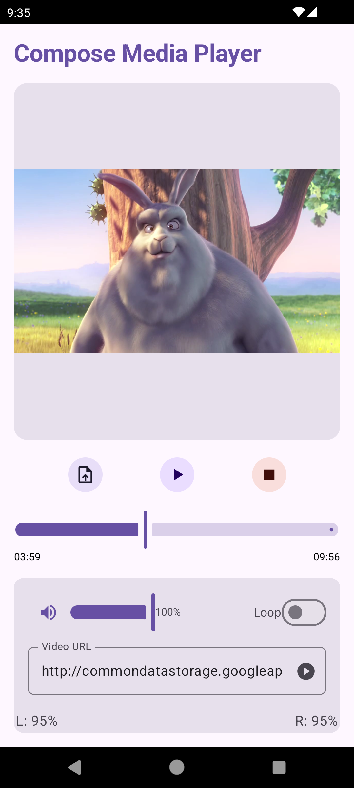

# 🎥 Compose Media Player

**Compose Media Player** is a video player library designed for Compose Multiplatform, supporting multiple platforms including Android, macOS, Windows, and Linux. It is the first fully functional multiplatform video player for Compose for Desktop that requires no additional software installations. The library leverages:

- **GStreamer** for Linux
- **JavaFX** for macOS and Windows (using native platform APIs)
- **Media3** for Android

## ✨ Features

- **Multiplatform Support**: Works seamlessly on Android, macOS, Windows, and Linux.
- **File and URL Support**: Play videos from local files or directly from URLs.
- **Media Controls**: Includes play, pause, loop toggle, volume control, and timeline slider.
- **Custom Video Player UI**: Fully customizable using Jetpack Compose.
- **Audio Levels**: Displays left and right audio levels in real time.

## 🔧 Installation

To add Compose Media Player to your project, include the following dependency in your `build.gradle.kts` file:

```kotlin
dependencies {
    implementation("io.github.kdroidfilter:composemediaplayer:0.1.1")
}
```

### Note:
Currently, you also need to manually include JavaFX dependencies for your platform as described in the [Known Issues](https://github.com/kdroidFilter/Compose-Media-Player?tab=readme-ov-file#%EF%B8%8F-known-issues) section. A patch is being developed to address this requirement.

## 🚀 Getting Started

### 📋 Basic Example

Here is a minimal example of how to integrate the Compose Media Player into your Compose application with a hardcoded URL:

```kotlin
@Composable
fun App() {
    val playerState = rememberVideoPlayerState()

    MaterialTheme {
        Column(modifier = Modifier.fillMaxSize().padding(8.dp)) {

            // Video Surface
            Box(
                modifier = Modifier.weight(1f).fillMaxWidth(),
                contentAlignment = Alignment.Center
            ) {
                VideoPlayerSurface(
                    playerState = playerState,
                    modifier = Modifier.fillMaxSize()
                )
            }

            Spacer(modifier = Modifier.height(8.dp))

            // Playback Controls
            Row(horizontalArrangement = Arrangement.SpaceBetween, modifier = Modifier.fillMaxWidth()) {
                Button(onClick = { playerState.play() }) { Text("Play") }
                Button(onClick = { playerState.pause() }) { Text("Pause") }
            }

            Spacer(modifier = Modifier.height(8.dp))

            // Open Video URL
            Button(
                onClick = {
                    val url = "http://commondatastorage.googleapis.com/gtv-videos-bucket/sample/BigBuckBunny.mp4"
                    playerState.openUri(url)
                }
            ) {
                Text("Open Video")
            }

            Spacer(modifier = Modifier.height(8.dp))

            // Volume Control
            Text("Volume: ${(playerState.volume * 100).toInt()}%")
            Slider(
                value = playerState.volume,
                onValueChange = { playerState.volume = it },
                valueRange = 0f..1f
            )
        }
    }
}
```

See the example above for more details.

## 📄 License

Compose Media Player is licensed under the MIT License. See [LICENSE](LICENSE) for details.

## 📊 Roadmap

- **iOS and WebAssembly (WasmJS) Support**: Expand support to additional platforms to enhance compatibility.
- **Audio Player**: Introduce a standalone audio player for handling audio-only content.
- **Player with Separate Audio and Video Streams**: Add functionality to support different audio and video streams for advanced playback scenarios.

## 🟎️ Screenshots of the Demo App

### Windows


### Linux


### Android


## ⚠️ Known Issues

### Platform-Specific JavaFX Dependencies

To use the Compose Media Player library, you must manually include the appropriate JavaFX dependencies for your operating system and architecture. This is due to the platform-specific nature of JavaFX. The classifier for your platform can be determined using the following logic:

```kotlin
val osName = System.getProperty("os.name").lowercase(Locale.getDefault())
val osArch = System.getProperty("os.arch").lowercase(Locale.getDefault())

val fxClassifier = when {
    osName.contains("linux") && osArch.contains("aarch64") -> "linux-aarch64"
    osName.contains("linux") -> "linux"
    osName.contains("windows") -> "win"
    osName.contains("mac") && osArch.contains("aarch64") -> "mac-aarch64"
    osName.contains("mac") -> "mac"
    else -> throw IllegalStateException("Unsupported OS: $osName")
}

val javafxVersion = "22.0.1"
```

#### JavaFX Dependencies
After determining the correct classifier, include the following dependencies in your project. Ensure you are using JavaFX version `22.0.1`:

```kotlin
implementation("org.openjfx:javafx-base:\${javafxVersion}:<fxClassifier>")
implementation("org.openjfx:javafx-graphics:\${javafxVersion}:<fxClassifier>")
implementation("org.openjfx:javafx-swing:\${javafxVersion}:<fxClassifier>")
implementation("org.openjfx:javafx-media:\${javafxVersion}:<fxClassifier>")
```

### JavaFX Warning on macOS and Windows: A warning message may appear during runtime:

  ```
  Jan 20, 2025 7:24:02 AM com.sun.javafx.application.PlatformImpl startup
  WARNING: Unsupported JavaFX configuration: classes were loaded from 'unnamed module @367d4c06'
  ```

This warning does not appear to cause any functional issues but is under investigation.


